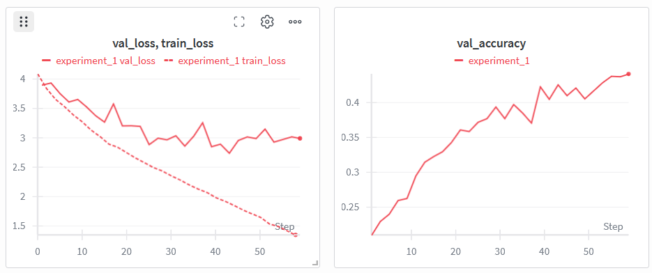
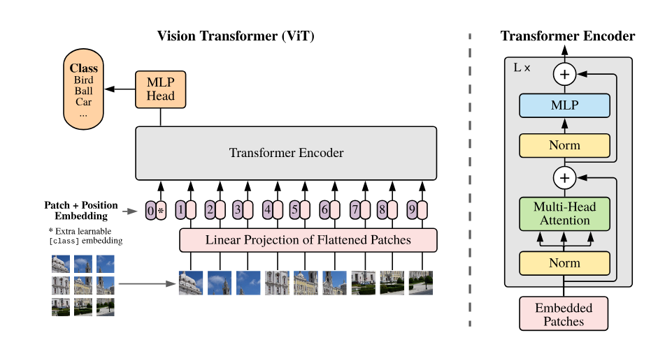

# Creating the Vision Transformer (VIT) from scratch

This repository contains a **from-scratch implementation** of the Vision Transformer (ViT) developed during the **Deep Learning with PyTorch** course at [MIREA – Russian Technological University](https://www.mirea.ru/) (2024–2025 academic year).

Based on the original paper:  
📄 [An Image is Worth 16x16 Words: Transformers for Image Recognition at Scale](https://arxiv.org/abs/2010.11929) (Dosovitskiy et al., 2020)

📊 Training logs and visualizations: [Weights & Biases Project](<https://wandb.ai/shadaevf-rtu-mirea/Vit_project_1/runs/mpm0658j>)

## 📊 Results

Trained on **Caltech101** (9,146 images, 101 object categories) for 30 epochs with SGD optimizer

| Metric                | Value                 |
|-----------------------|-----------------------|
| Validation Accuracy   | 44.8%                 |
| Validation Loss       | 2.99                  |
| Training Time         | ~40 min (Google Colab)|
| Parameters            | 86M                   |



## 🧠 Architecture Overview



Key components implemented from scratch:

- **Patch Embedding**: 16×16 image patches → linear projection into 768-dim vectors
- **Positional Embeddings**: Learnable 1D positional encodings
- **Transformer Encoder**: 12 layers with 12 attention heads, MLP ratio 4:1
- **Classification Head**: LayerNorm + linear projection to 101 output classes

---

## 📁 Project structure

```text
VIT_project/
├── __init__.py          # Entry point (run via python -m VIT_project)
├── data.py              # Caltech101 loading, normalization, train/test split
├── model.py             # Full ViT implementation
├── training.py          # Training/validation loops with wandb logging
└── config.py            # Hyperparameters (lr, batch_size, patch_size, etc.)
pyproject.toml           # Project dependencies and metadata
assets/                  # Diagrams and training visualizations
├── vit_architecture.png
└── training_curves.png
```

## 🛠️ Technologies Used

| Category       | Libraries              |
|----------------|------------------------|
| Core           | Python 3.13, Poetry    |
| Neural Networks| `torch`, `torchvision` |
| Visualization  | `wandb`                |
| Tensor ops     | `einops`               |

🔗 See [`pyproject.toml`](./pyproject.toml) for the complete dependency list.

## ▶️ How to Run

To run the notebooks locally, follow these steps:

1. Clone this repository:  

   ```bash
   git clone https://github.com/MrDeryf/Vision-Transformer
   ```

2. Install dependencies using [Poetry](https://python-poetry.org/):

    ```bash
   poetry install
   ```

3. Run the project:  

    ```bash
   poetry run python -m VIT_project
   ```
